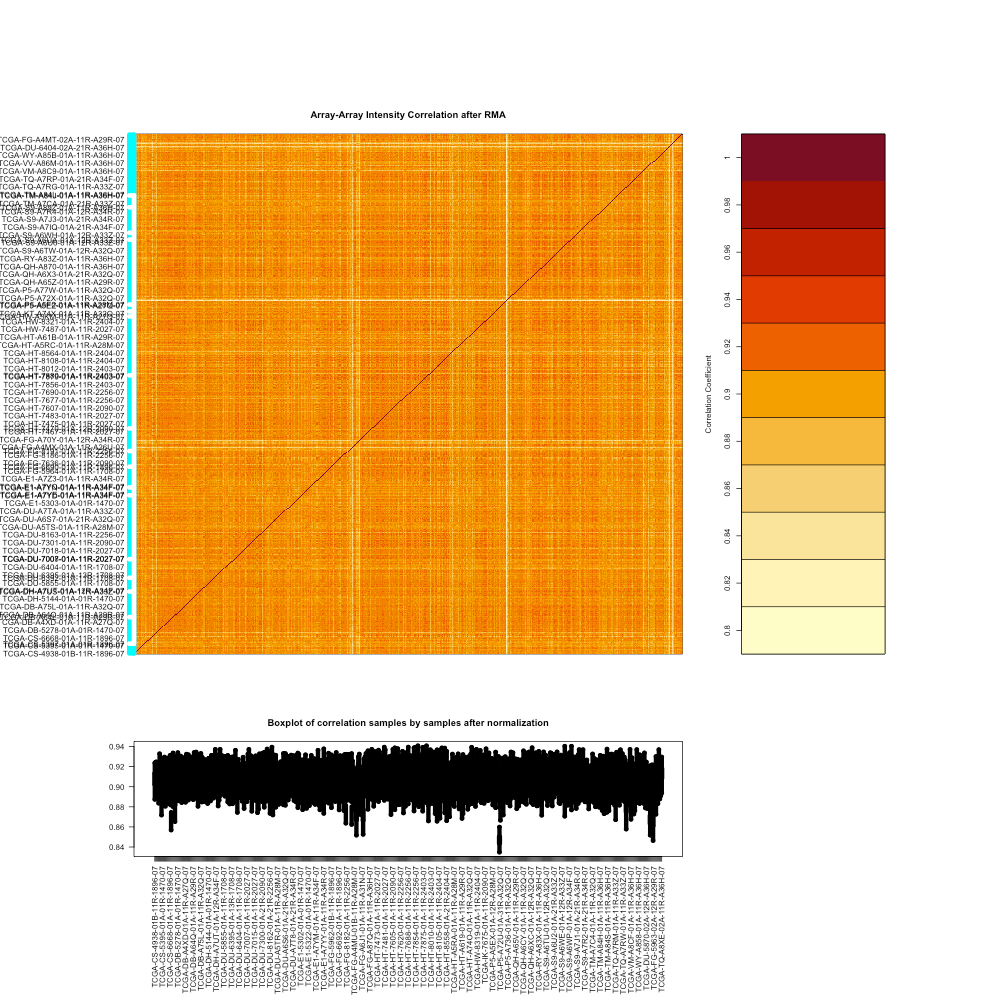

The URL to this website is https://ninada-u.github.io/Analyzing-CNVs-between-GBM-and-LGG/

By Yifei Ning, Siqi Huang, and Noah Inada


The intended audience for this webpage is those with basic knowledge of biology/genetics - e.g. highschool or college graduates. We discuss the brain cancer Glioblastoma Multiforme and brain tumors low-grade gliomas. We also discuss Copy Number Variation, a form of genetic variation. The outline of our website will be structured similar to our elevator pitch, maybe with images and more details.


```

```

We have not confirmed our visualizations yet, but right now we may go with:

- A heatmap comparing the CNVs of those with Glioblastoma Multiforme and those with a low-grade glioma
- Manhattan plots and/or concordance-at-the-top plots also comparing the CNVs between the two populations

We may also include some Python and R `code`.