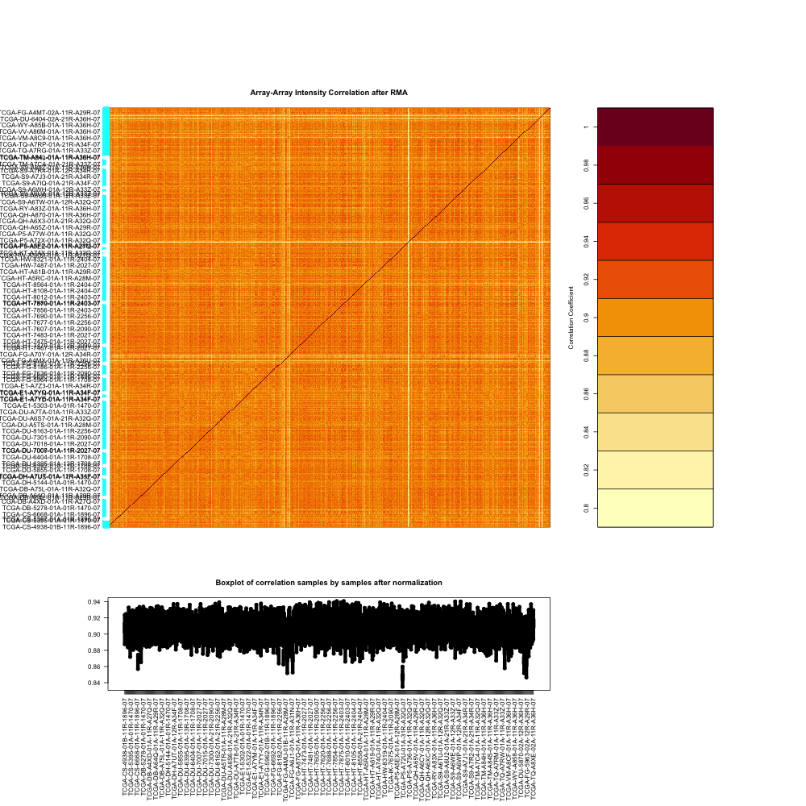
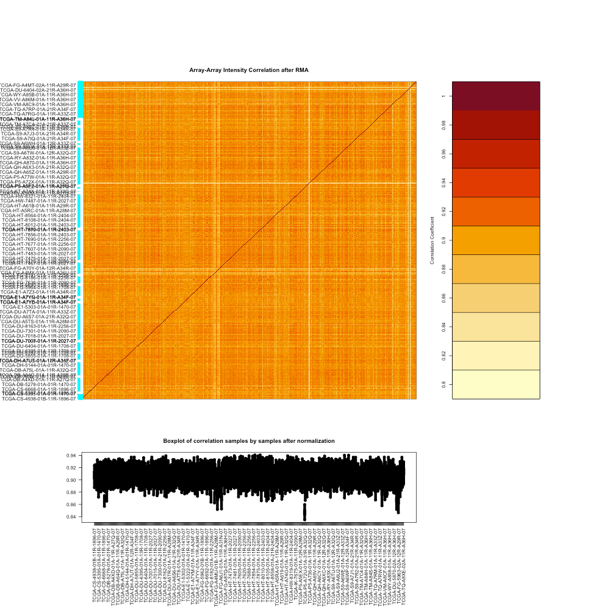

The URL to this website is https://ninada-u.github.io/Analyzing-CNVs-between-GBM-and-LGG/

By Yifei Ning, Siqi Huang, and Noah Inada

The website will have a story telling feature. We will assume the audience is the general public, so we will have a introduction section, a background section, a modeling section, a viz section, and a Q&A section. In this way, we could effectively communicate with our target audience and the audience could also interact with the features in the websites.

Here are heatmaps of array-array intensity comparing the CNVs of those with Glioblastoma Multiforme and those with a low-grade glioma. Included are boxplots of correlation samples by samples after normalization of the two populations.